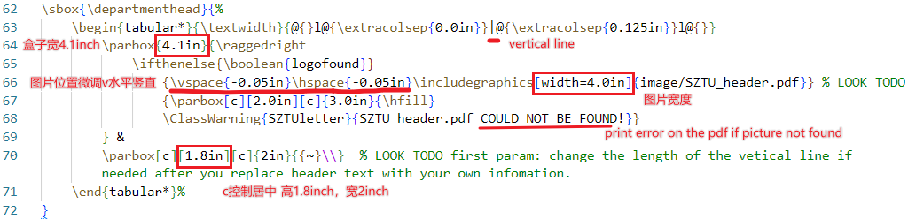
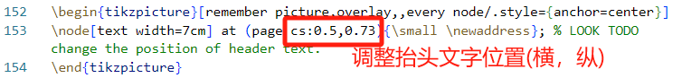
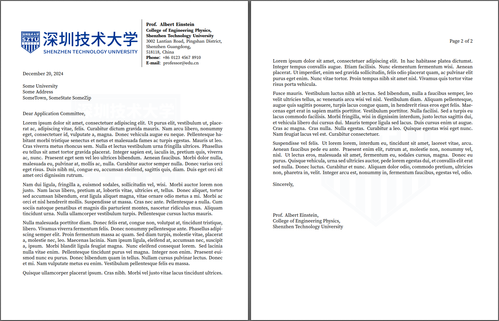

# 深圳技术大学推荐信模板

:page_facing_up: 这是一个用于撰写深圳技术大学推荐信的 LaTeX 模板。

> 参考： RizhongLin 的 **[tongji-recommendation-template](https://github.com/TJ-CSCCG/tongji-recommendation-template)** 同济大学推荐信的 LaTeX 模板。
>
> LOGO来源： **[SZTU-Thesis-Latex-Template](https://github.com/SZTU-ACM/SZTU-Thesis-Latex-Template)** 深圳技术大学本科毕业论文Latex模板

## :one: 使用

 Overleaf 模板：tba

编译器用 **LuaLaTeX**。

本地运行需下载 Source Serif Pro 字体文件 [Source Serif Pro Font Free by Adobe » Font Squirrel](https://www.fontsquirrel.com/fonts/source-serif-pro)

## :two: Notes

- ` SZTUletter.cls ` 抬头logo位置控制



- `mian.tex` 抬头文字位置控制



- 添加了href超链接，点击单位自动跳转
- 去掉了页脚\cfoot
- 落款靠左 \closing命令处注释掉\hfill

## :three: 示例



## :four: 许可证

使用 **LPPL-1.3c** 许可证。

```
%% Copyright 2023 TJ-CSCCG
%
% This work may be distributed and/or modified under the
% conditions of the LaTeX Project Public License, either version 1.3
% of this license or (at your option) any later version.
% The latest version of this license is in
%   http://www.latex-project.org/lppl.txt
% and version 1.3 or later is part of all distributions of LaTeX
% version 2003/12/01 or later.
%
% This work has the LPPL maintenance status "maintained".
%
% This Current Maintainer of this work is R. Lin.
%
% This work consists of all the *.tex, *.cls and *.sty files in
%   https://github.com/TJ-CSCCG/tongji-recommendation-template
```
